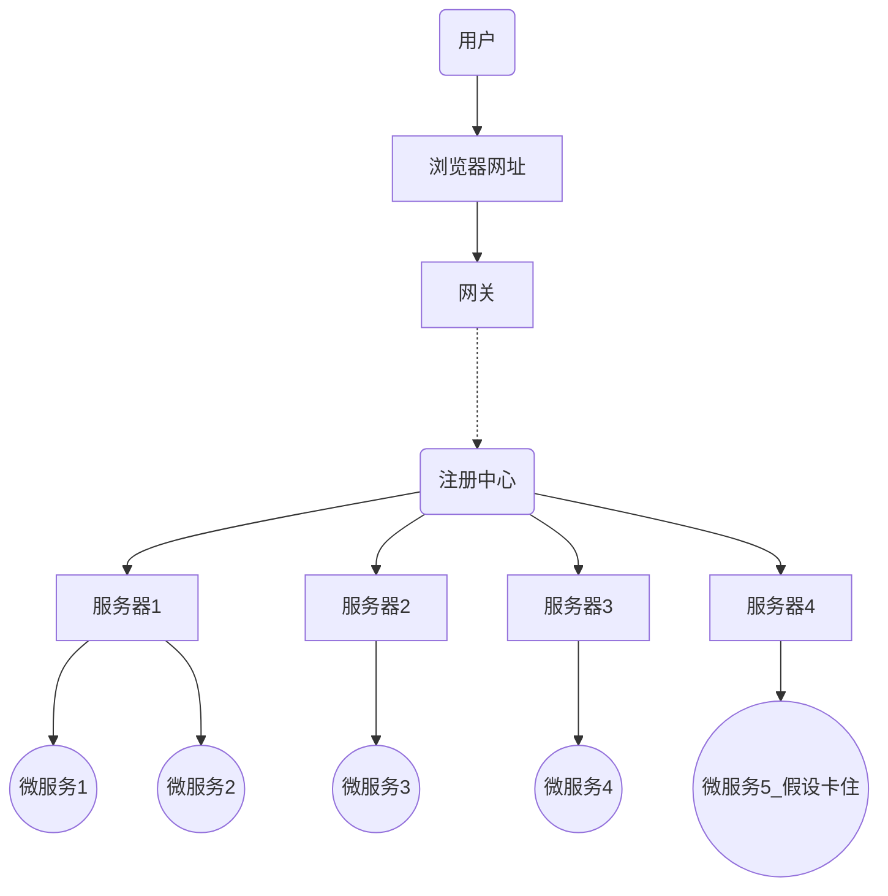
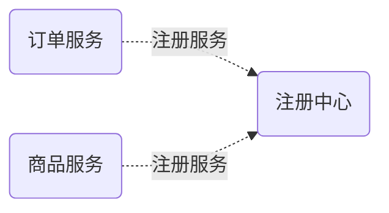
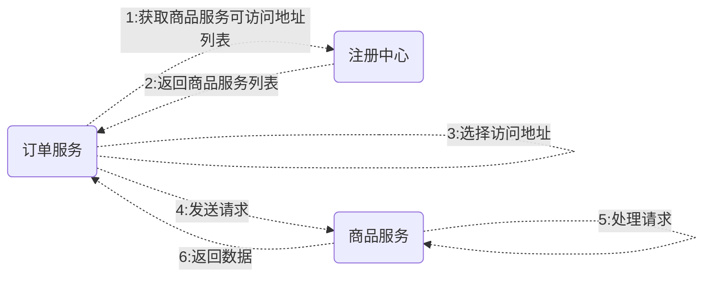
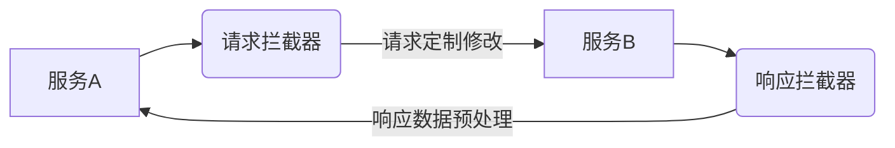
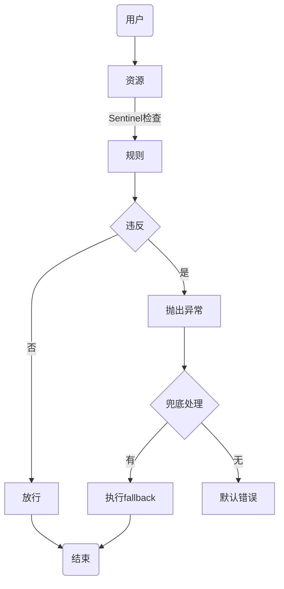

# SpringCloud学习项目

### 项目简介
学习SpringCloud分布式程序开发和部署所创建的学习项目

### 分布式结构简介

以上用到的技术如下
* 网关:SpringCloudGetWay
   * 用户只需要在浏览器访问固定的网址,即可获取到不同服务器上的服务
* 注册中心: SpringCloudAlibabaNacos
  * 微服务的注册与发现
* 微服务本体: SpringBoot
* 远程调用: SpringCloudOpenFeign
  * 不同微服务之间的数据交互业务,需要用到远程调用,会通过注册中心发现服务
  * 假设订单服务需要调用商品服务,示意图如下:


* 服务熔断(服务保护): SpringCloudAlibabaSentinel
  * 当多个微服务组成一共业务的时候,其中一共微服务卡住,则整条业务链就会卡住,称为服务雪崩;为了避免服务雪崩,则需要在其中一个服务卡住的时候快速返回失败,避免卡住的情况,即服务熔断
* 分布式事务: SpringCloudAlibabaSeata
  * 当多个微服务组成一共业务的时候,引入事务急值,即为分布式事务

### Maven设置
设置国内库:在`settings.xml`中的`<settings>`标签内部添加如下代码:
```xml
<!--国内库-->
<mirrors>
  <mirror>
      <id>alimaven</id>
      <mirrorOf>central</mirrorOf>
      <name>aliyun maven</name>
      <url>http://maven.aliyun.com/nexus/content/groups/public/</url>
  </mirror>
  <mirror>
      <id>uk</id>
      <mirrorOf>central</mirrorOf>
      <name>UK Maven</name>
      <url>http://uk.maven.org/maven2/</url>
  </mirror>
  <mirror>
      <id>CN</id>
      <mirrorOf>central</mirrorOf>
      <name>OSChina Central</name>
      <url>http://maven.oschina.net/content/groups/public/</url>
  </mirror>
  <mirror>
      <id>nexus</id>
      <mirrorOf>central</mirrorOf>
      <name>Nexus Repository</name>
      <url>http://repo.maven.apache.org/maven2</url>
  </mirror>
</mirrors>
```


### 框架版本
| 框架                 | 版本         |
|--------------------|------------|
| SpringCloud        | 2023.0.3   |
| SpringCloudAlibaba | 2023.0.3.2 |
| SpringBoot         | 3.3.4      |


| 组件软件     | 版本    | 功能                  | 启动方式 | 官网地址 |
|----------|-------|---------------------| --- | --- |
| Nacos    | 2.4.3 | 动态服务注册与发现,配置管理和服务管理 | startup.cmd -m standalone | https://nacos.io/ |
| Sentinel | 1.8.8 | ---                 |
| Seata    | 2.2.0 | ---                 |

### 工程结构
* cloud-demo //控制框架版本
    * model //公共模型层,用于存放所有的模型实体,由于不同服务之间存在远程调用的关系,所以需要用到不同服务的对象实体模型,故而将其提出为一个model
    * services  //所有的微服务
       * service-order
       * service-product

### 创建项目
1. 新增一个工程
2. 选择SpringBoot项目创建模板
3. 确定好jdk版本(此处为17),下一页不需要修改`SpringBoot`版本(后由pom.xml统一管理)直接点击创建即可
4. 创建项目后吧多余的文件删除,只保留`pom.xml`和`.idea`(idea自带的文件夹),包括`.mvn`也需要删除
5. 修改`pom.xml`以管理版本,此为项目最外层`pom.xml`,用于控制三大框架版本,包括`SpringBoot``SpringCloud``SpringCloudAlibaba`的版本
   1. 由于此为最外层,所以添加打包方式为`pom`,代码:`<packaging>pom</packaging>`
   2. 修改`SpringBoot`的版本,此项目用的是`3.3.4`
   3. 将`dependencies`和`properties`整个删除,手动添加大件版本及依赖,此项目添加如下:
   ```xml
   <!--大件版本-->
   <properties>
     <maven.compiler.source>17</maven.compiler.source>
     <maven.compiler.target>17</maven.compiler.target>
     <project.build.sourceEncoding>UTF-8</project.build.sourceEncoding>
     <spring-cloud.version>2023.0.3</spring-cloud.version>
     <spring-cloud-alibaba.version>2023.0.3.2</spring-cloud-alibaba.version>
   </properties>
   <!--使用导入的方式添加cloud和alibaba-->
   <dependencyManagement>
     <dependencies>
         <dependency>
             <groupId>org.springframwork.cloud</groupId>
             <artifactId>spring-cloud-dependencies</artifactId>
             <version>${spring-cloud.version}</version>
             <type>pom</type>
             <scope>import</scope>
         </dependency>
         <dependency>
             <groupId>com.alibaba.cloud</groupId>
             <artifactId>spring-cloud-alibaba-dependencies</artifactId>
             <version>${spring-cloud-alibaba.version}</version>
             <type>pom</type>
             <scope>import</scope>
         </dependency>
     </dependencies>
   </dependencyManagement>
   ```
   到此,三大框架的版本已设置
6. 创建services项目(模组)
   1. 选中最外层父项目,`new`一个`Module`,选择`Java`(不要选SpringBoot了),名字写`services`,点击创建
   2. 删除多余的文件只保留`pom.xml`
   3. 检查`pom.xml`,确定其父项目名称是否正确,查看
   ```xml
   <parent>
      <groupId>com.engine</groupId>
      <artifactId>cloud-demo</artifactId>
      <version>0.0.1-SNAPSHOT</version>
   </parent>
   ```
   4. 修改其`pom.xml`,由于其也是用于管理子项目的,所以加上`<packaging>pom</packaging>`设置它的打包方式
   5. 在其内部创建子项目(微服务本体),和创建`services`过程一样,最后检查其`pom.xml`中父项目是否正确,不需要设置打包方式
   6. 在`services`层的`pom.xml`中引入所有微服务都需要用到的公共依赖

### 单元测试
1. 在微服务的pom.xml中添加依赖:
```xml
<dependency>
   <groupId>org.springframework.boot</groupId>
   <artifactId>spring-boot-starter-test</artifactId>
   <scope>test</scope>
</dependency>
```
2. 在src/test(/java)中添加注册类即可,包名需要与微服务启动类包名一致,注册类需要添加`@SpringBootTest`注解


### Nacos注册中心,服务注册与发现
#### 服务注册
* 去官网下载Nacos

| 流程 | 内容 | 核心                                              |
|  --- | --- |-------------------------------------------------|
| 步骤1 | 启动微服务 | SpringBoot微服务web项目启动                            |
| 步骤2 | 引入服务发现依赖 | spring-cloud-starter-alibaba-nacos-discovery    |
| 步骤3 | 配置Nacos地址 | spring.cloud.nacos.server-addr = 127.0.0.1:8848 |
| 步骤4 | 查看注册中心效果 | http://127.0.0.1:8848/nacos                     |
| 步骤5 | 集群模式测试启动 | 单机情况下通过改变端口模拟微服务集群 |

* 具体实现如下:
1. `services`层的`pom.xml`添加`nacos`依赖为公共依赖
```xml
<dependency>
   <groupId>org.springframework.boot</groupId>
   <artifactId>spring-boot-starter-web</artifactId>
</dependency>
```
2. 微服务的`pom.xml`添加依赖:
```xml
<dependency>
   <groupId>org.springframework.boot</groupId>
   <artifactId>spring-boot-starter-web</artifactId>
</dependency>
```
3. 为微服务添加一个启动类,例如:
```java
@SpringBootApplication
public class OrderMainApplication {
    public static void main(String[] args) {
        SpringApplication.run(OrderMainApplication.class, args);
    }
}
```
4. 为微服务创建配置文件`application.properties`,例如:
```properties
#常规属性
spring.application.name=server-order
server.port=8000

#Nacos连接地址
spring.cloud.nacos.server-addr=127.0.0.1:8848
```
5. 开启服务发现,在启动类中添加注解`@EnableDiscoveryClient`
6. 直接启动微服务即可

#### 服务发现及远程调用
##### 无负载均衡
* 使用DiscoveryClient或者NacosServiceDiscovery服务发现
* 拼接url地址
* 使用RestTemplate发送请求
* 示例代码:
```java
//远程调用商品服务(无负载均衡)
private Product getProductFromRemote(Long productId) {
    //1.获取商品服务所在的url
    List<ServiceInstance> instances = discoveryClient.getInstances("service-product");
    ServiceInstance serviceInstance = instances.get(0);
    String url = "http://" + serviceInstance.getHost() + ":" + serviceInstance.getPort() + "/product/" + productId;
    log.info("远程请求:{}", url);
    //2.发送远程请求
    Product product = restTemplate.getForObject(url, Product.class);
    return product;
}
```
* NacosServiceDiscovery与DiscoveryClient用法一致,区别在于DiscoveryClient它由SpringBoot提供,不需要额外依赖;NacosServiceDiscovery则需要以下依赖:
```xml
<!--服务注册与发现-->
<dependency>
    <groupId>com.alibaba.cloud</groupId>
    <artifactId>spring-cloud-starter-alibaba-nacos-discovery</artifactId>
</dependency>
```
##### 负载均衡
* 使用`LoadBalancerClient`来制作负载均衡功能,位于`org.springframework.cloud.client.loadbalancer`包下
* 需要导入依赖
```xml
<!--负载均衡-->
<dependency>
    <groupId>org.springframework.cloud</groupId>
    <artifactId>spring-cloud-starter-loadbalancer</artifactId>
</dependency>
```
* 与上面的`DiscoveryClient`使用方法类似,示例代码:
```java
//远程调用商品服务(负载均衡)
private Product getProductFromRemoteWithLoadBalancer(Long productId) {
    //1.获取商品服务所在的url
    ServiceInstance choose = loadBalancerClient.choose("service-product");
    //String url = "http://" + choose.getHost() + ":" + choose.getPort() + "/product/" + productId;
    String url = choose.getUri() + "/product/" + productId;
    log.info("远程请求:{}", url);
    //2.发送远程请求
    Product product = restTemplate.getForObject(url, Product.class);
    return product;
}
```
##### 基于注解的负载均衡
* 上面两个案例中使用`restTemplate`进行远程调用,它在config注册到`BeanFactory`,以实现自动注入
* 只需要给`restTemplate`注册代码添加`@LoadBalanced`注解,则使其自动带有负载均衡功能,示例代码
```java
@Bean
@LoadBalanced
public RestTemplate restTemplate() {
    return new RestTemplate();
}
```
* 拥有@LoadBalanced后,使用它进行远程调用不需要传入具体ip地址的url,而是在传入带有微服务名称的url,示例代码如下:
```java
//远程调用商品服务(注解负载均衡)
private Product getProductFromRemoteWithLoadBalancerAnnotation(Long productId) {
    //1.获取商品服务所在的url
    String url = "http://service-product/product/" + productId;
    //2.发送远程请求
    Product product = restTemplate.getForObject(url, Product.class);
    return product;
}
```
##### 知识补充
* Nacos注册中心宕机后假设微服务被调用过,则还能继续调用;如果微服务没被调用过,则无法调用;原因是注册中心存在服务列表缓存,调用过的微服务信息则会在列表缓存中,如果注册中心宕机了,负载均很依旧会从缓存中取得目标服务地址.

### Nacos配置中心读写配置属性
1. 在Nacos网页页面新增配置,填入`Data ID`与配置内容,`Data ID`一般命名为`微服务名.properties`,配置内容则自定义,如`order.timeout=30min`
2. 代码添加配置中心依赖
```xml
<!--配置中心-->
<dependency>
    <groupId>com.alibaba.cloud</groupId>
    <artifactId>spring-cloud-starter-alibaba-nacos-config</artifactId>
</dependency>
```
3. 导入Nacos配置到application.properties,即在application.properties中新增
```properties
spring.config.import=nacos:service-order.properties
```
4. 读取配置属性
   * 方法一:根据`@RefreshScope`与`@Value("${key}")`动态取
      1. 使用`@Value("${key}")`注解在属性上可自动获取
      2. 若要做到获取实时修改的配置,则需要在类上加`@RefreshScope`注解
      3. 示例代码:
        ```java
        
        @RefreshScope
        @RestController
        public class OrderController {
            @Value("${order.timeout}")
            String orderTimeout;
            @Value("${order.auto-confirm}")
            String orderAutoConfirm;
        
            @GetMapping("/config")
            public String config(){
                return "orderTimeout:" + orderTimeout +";"+"orderAutoConfirm:" + orderAutoConfirm;
            }
        }
        ```
   * 方法二:使用`@ConfigurationProperties`
      * 将配置的属性抽象为一个实体类,创建属性对象,并为其添加`@ConfigurationProperties`,`@Data`,`@Component`注解,示例代码:
        ```java
        @Data   //需要getter setter
        @Component  //用于自动注入
        @ConfigurationProperties(prefix = "order")  //核心注解,指定前缀
        public class OrderProperties {
            private String timeout;
            private String autoConfirm; //order.auto-confirm 由于指定了前缀则不需要写order,'-'号使用驼峰命名即可映射
        }
        ```
        ```java
        @RestController
        public class OrderController {
            @Autowired
            OrderProperties orderProperties;
        
            @GetMapping("/config")
            public String config(){
                return "orderTimeout:" + orderProperties.getTimeout()+";"+"orderAutoConfirm:" + orderProperties.getAutoConfirm();
            }
        }
        ```
5. 监听`Nacos`配置文件变化
   1. 使用`ApplicationRunner`创建一次性任务,它会在代码启动时执行 
   2. 为`NacosConfigManager`设置监听
   3. 示例代码(卸载微服务的Application启动类中):
    ```java
    //1. 项目启动就监听Nacos配置文件的变化
    //2. 拿到变化的值
    //3. 模拟邮件通知
    @Bean   //Bean后可直接使用BeanFactory内部已有的工具作为入参
    ApplicationRunner applicationRunner(NacosConfigManager nacosConfigManager) {
    //        return new ApplicationRunner() {
    //            @Override
    //            public void run(ApplicationArguments args) throws Exception {
    //            }
    //        };
        //简写
        return args -> {
            System.out.println("Application Started,项目启动");
            ConfigService configService = nacosConfigManager.getConfigService();    //获取服务
            configService.addListener("service-order.properties", "DEFAULT_GROUP", new Listener() {
                //线程池
                @Override
                public Executor getExecutor() {
                    //需要new一个固定大小的线程池
                    return Executors.newFixedThreadPool(4);
                }
                //监听接收变化配置
                @Override
                public void receiveConfigInfo(String configInfo) {
                    System.out.println("变化配置信息: "+configInfo);
                    System.out.println("发送通知...");
                }
            });
        };
    }
    ```

6. 假设`Nacos`网页中没有配置好内容,同时在`application.properties`导入了那个未配置的配置文件,在启动的时候会报错,有如下两种方式可以规避报错
   1. 关闭启动校验导入内容,在`application.properties`添加`spring.cloud.nacos.config.import-check.enabled=false`即可
   2. 设置`Nacos`配置文件导入为可选的,需要将`spring.config.import=nacos:service-order.properties`改为`spring.config.import=optional:nacos:service-order.properties`
7. 假设`application.properties`和`Nacos`中都配置了相同的内容,则`Nacos`中的生效,如果导入的多个配置文件中有相同的配置,则先声明的配置优先;`即外部优先,先导入优先`
8. `Nacos`数据隔离
   1. 从此开始application.properties改为application.yml
   2. `Nacos`提供了:命名空间,组和DataID的功能
      1. namespace命名空间:用来区分开发环境,如`dev`,`prod`,`test`,配置文件中填入的是命名空间的id
      2. group组:用来区分微服务,取名可以以服务名称来指定
      3. DataID:具体的配置文件名
   3. 配置示例:
    ```yaml
    server:
      port: 8000
    spring:
      application:
        name: service-order
      cloud:
        nacos:
          server-addr: 127.0.0.1:8848
          config:
            namespace: dev  #开发环境,命名空间id
            group: service-order  #服务
      config:
        import: #需要加载的具体配置文件
          - nacos:common.properties 
          - nacos:database.properties
    ```
   4. 这种方式可以将不同的开发环境与微服务区分开,但是引出一个问题:当不同的开发环境需要导入的配置文件不同时,则需要动态配置导入部分;需要使用到activate配置,代码如下
```yaml
server:
  port: 8000
spring:
  profiles:
    active: dev
  application:
    name: service-order
  cloud:
    nacos:
      server-addr: 127.0.0.1:8848
      config:
        namespace: ${spring.profiles.active:public}  #开发环境,命名空间id
        group: service-order  #服务

---
spring:
  config:
    import: #需要加载的具体配置文件
      - nacos:common.properties
      - nacos:database.properties
    activate:
      on-profile: dev
---
spring:
  config:
    import: #需要加载的具体配置文件
      - nacos:common.properties
      - nacos:database.properties
    activate:
      on-profile: test
---
spring:
  config:
    import: #需要加载的具体配置文件
      - nacos:common.properties
      - nacos:database.properties
    activate:
      on-profile: prod
```

### OpenFeign远程调用
1. 自身业务之间微服务的远程调用
   1. 使用`@EnableFeignClients`开启Feign远程调用客户端功能,放在启动类上(Application)
   2. 创建Feign客户端
      1. 创建一个接口
      2. 为接口添加`@FeignClient(value = "service-product")`注解表示此接口为一个Feign客户端,value内容则是目标服务的名字
      3. 添加接口,可直接将目标服务的接口复制过来使用(去掉方法体),示例代码如下:
       ```java
       @FeignClient(value = "service-product")
       public interface ProductFeignClient {
           @GetMapping("/product/{id}")
           Product getProduct(@PathVariable("id") Long productId);
       }
       ```
   3. 直接调用此接口的方法即可完成远程调用,同时自动负载均衡
2. 第三方API的远程调用
* 和上面自身调用使用方法一致,区别在于`@FeignClient()`不光要指定`value`,还需要指定目标的`url`,例如:
```java
@FeignClient(value = "customName",url = "http://xxx.xxxx.com")
public interface testApi {
    @PostMapping("/xxxx/xxxx")
    Product getData(@RequestHeader("header1") Strring header1,
                    @RequestHeader("token") Strring token,
                    @RequestParam("dataKey") String dataKey,
                    @RequestBody("user") User user);
}
```
* 传入参数使用不同的注解控制其再请求协议中的位置,比如`@RequestHeader``@RequestParam``@RequestBody`
3. 客户端负载均衡与服务端负载均衡的区别
   1. 客户端负载均衡表示Feign客户端调用自身其它微服务时,会先到注册中心,确定好目标后调用;即为`发起调用的这一端,自己根据负载均衡算法选择对方的地址进行调用,负载均很发生在客户端`
   2. 服务端负载均很表示Feign请求第三方API,`负载均衡由被调用服务端负责,实现数据返回`
4. Feign日志
   1. 配置文件中编辑日志级别,内容为指定特定包或者类的日志级别:
    ```yaml
    logging:
      level:
        com.engine.feign: debug
    ```
   2. 在配置类中添加Feign的全记录组件
    ```java
    @Bean
    Logger.Level feignLoggerLevel() {
        return Logger.Level.FULL;
    }
    ```
5. OpenFeign超时控制
   1. 使用场景:当一个服务调用另一个服务接口,同时另一个服务接口异常,无法返回数据时,会造成阻塞,并发量大的时候则造成服务雪崩,使用超时控制来设置调用的等待时间
    ```mermaid
    graph TB
    Feign(OpenFeign远程调用) --> Time{等待时间}
    Time --> NTimeout[未超时]
    NTimeout --> Success[返回正确结果]
    Time --> Timeout[超时]
    Timeout --> Stop[中断调用]
    Stop --> Failed[返回错误信息,超时控制达到此效果]
    Stop --> FData[返回兜底数据,需要熔断机制,后面会接触到]
    ```
   2. 超时时间分为`connectTime`连接超时和`readTimeout`读取超时,分别为连接阶段以及建立连接后的获取数据返回阶段的时限,超时时间分别默认为10秒与60秒
   3. 具体配置,其中指定Feign客户端的名字来源于Feign客户端注解的Value值,即`@FeignClient(value = "service-product")`,假设注解中配置了`contextId`,则使用`contextId`的值作为名字
    ```yaml
    spring:
      cloud:
        openfeign:
          client:
            config:
              #默认配置
              default:
                logger-level: full
                connect-timeout: 1000
                read-timeout: 2000
              #默认配置,指定Feign客户端设置
              service-product:
                logger-level: full
                connect-timeout: 3000
                read-timeout: 5000
    ```
5. OpenFeign重试机制
* 超时机制中,请求时间过长会导致返回异常,重试机制则为异常后自动重试请求,默认是never也就是从不重试
* 重试器需要配置:`最大重试请求次数,初次失败后触发重试时间间隔,最大重试时间间隔`;
* 每一次重试请求的时间间隔为:`上一次的间隔时间*1.5,同时不超过最大时间间隔`
* 在配置类中配置重试器:
```java
@Bean
Retryer  feignRetryer() {
    return new Retryer.Default();
}
```
6. OpenFeign拦截器

   1. 请求拦截器`RequestInterceptor`:在OpenFeign想其它服务发送请求时,请求发送前拦截,可以对请求数据定制修改后发送给目标服务
   2. 响应拦截器`ResponseInterceptor`:在OpenFeign获取到响应的时候,可以对响应数据做出修改再返回给调用服务
   3. 编写请求拦截器,新建类实现`RequestInterceptor`接口,使用`@Component`添加到容器中即可.
   4. 模拟添加Token示例代码:
```java
@Component
public class XTokenRequestInterceptor implements RequestInterceptor {
    @Override
    public void apply(RequestTemplate requestTemplate) {
        requestTemplate.header("X-Token", UUID.randomUUID().toString());
    }
}
```
6. OpenFeign兜底数据
* 当远程调用失败后,不仅可以使用`重试机制`,也可以返回预设的`兜底数据`
* 实现此功能需要导入`sentinel`熔断机制依赖,以下是具体流程
  1. 导入`sentinel`依赖
    ```xml
    <!--sentinel熔断机制-->
    <dependency>
        <groupId>com.alibaba.cloud</groupId>
        <artifactId>spring-cloud-starter-alibaba-sentinel</artifactId>
    </dependency>
    ```
  2. 配置文件中开启`sentinel`熔断机制
    ```yaml
    feign:
      sentinel:
        enabled: true
    ```
  3. 创建一个类,实现原本就已经存在的Feign客户端(Feign客户端本质上是一个接口),并使用`@Component`添加到容器中,其内部的所有实现方法都在于构建一个兜底的返回数据
    ```java
    @Component
    public class ProductFeignClientFallback implements ProductFeignClient {
        @Override
        public Product getProduct(Long productId) {
            Product product = new Product();
            product.setId(666L);
            product.setPrice(new BigDecimal(0));
            product.setProductName("兜底数据");
            product.setNum(1);
            return product;
        }
    }
    ```
  4. 在Feign客户端类的注解中添加`fallback`属性指向兜底类即可完成:`@FeignClient(value = "service-product",fallback = ProductFeignClientFallback.class )`
  5. 若要不需要所有拦截器都生效,则在配置文件中配置`request-interceptors:`指定生效的拦截器即可

### Sentinel服务保护

1. 整合使用